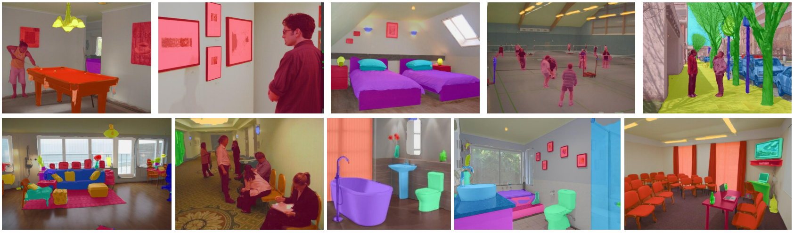
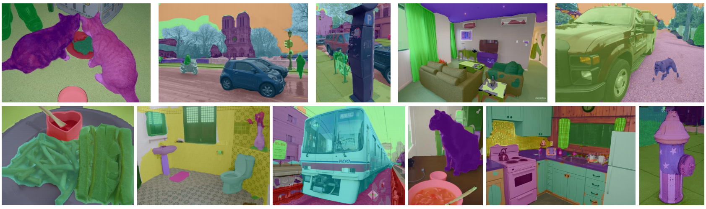

# Official Pytorch Implementation of QLSeg
### Multi-Query and Multi-Level Enhanced Network for Semantic Segmentation

## Highlights
* **Enhanced Decoder:**  A multi-query and multi-level enhanced network for semantic segmentation, which aims to exploit
diverse information at different feature map levels in plain transformer backbone.
* **Stronger performance:** We got state-of-the-art performance mIoU **56.2%** on ADE20K, mIoU **51.0%** on COCOStuff10K, and mIoU **60.2%** on PASCAL-Context datasets with the least amount of computational cost among counterparts using ViT backbone. 

## Updates
- `2023/06/09`: Code and models are released.

## Segmentation Results
<center></center>
<center>(a) Qualitative results on ADE20K</center>
<center></center>
<center>(b) Qualitative results on PASCAL-Context</center>
<center></center>
<center>(c) Qualitative results on COCO-stuff-10K</center>

## Getting started 

1. Install the [mmsegmentation](https://github.com/open-mmlab/mmsegmentation) library and some required packages.

```bash
pip install mmcv-full==1.7.1 mmsegmentation==0.30.0
pip install scipy timm
```
## Training
```
python tools/dist_train.sh  configs/qlseg/qlseg_vit-l_jax_640x640_160k_ade20k.py 
```
## Evaluation
```
python tools/dist_test.sh configs/qlseg/qlseg_vit-l_jax_640x640_160k_ade20k.py   {path_to_ckpt}
```

## Datasets
Please follow the instructions of [mmsegmentation](https://github.com/open-mmlab/mmsegmentation) data preparation

## Results
|    Model backbone    | datasets               |  mIoU  |  mIoU (ms)  | ckpt |
|:--------------------:|------------------------|:------:|:-----------:|---
       Vit-Base       | ADE20k                 |  52.9  |    53.6     |[Baidu Drive](https://pan.baidu.com/s/1IDYFNfko-UPwaAPRykRtlQ?pwd=u2jl), [Google Drive](https://drive.google.com/file/d/1-KjATwROIYVhYLg36Phd_n_-LsJXyg_N/view?usp=sharing) 
      Vit-Large       | ADE20k                 |  55.3  |    56.2     | [Baidu Drive](https://pan.baidu.com/s/1IDYFNfko-UPwaAPRykRtlQ?pwd=u2jl), [Google Drive]()
      Vit-Large       | COCOStuff10K           |  50.5  |    51.0     | [Baidu Drive](https://pan.baidu.com/s/1IDYFNfko-UPwaAPRykRtlQ?pwd=u2jl)
      Vit-Large       | PASCAL-Context (59cls) |  65.5  |    66.4     | [Baidu Drive](https://pan.baidu.com/s/1IDYFNfko-UPwaAPRykRtlQ?pwd=u2jl)
      Vit-Large       | PASCAL-Context (60cls) |  59.3  |    60.2     | [Baidu Drive](https://pan.baidu.com/s/1IDYFNfko-UPwaAPRykRtlQ?pwd=u2jl)


## License
For academic use, this project is licensed under the 2-clause BSD License - see the LICENSE file for details. For commercial use, please contact the authors.

## Citation
```
@article{xie2023qlseg,
  title={Multi-Query and Multi-Level Enhanced Network for Semantic Segmentation},
  author={Bin Xie, Jiale Cao, Rao Muhammad Anwer, Jin Xie, Fahad Shahbaz Khan, Yanwei Pang},
  journal={-},
  year={2023}
}
```

## Acknowledgement
Thanks to previous open-sourced repo: [SegVit](https://github.com/zbwxp/SegVit).
