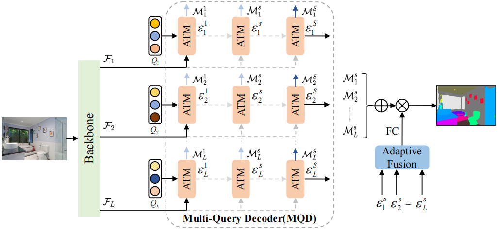

# Multi-Query and Multi-Level Enhanced Network for Semantic Segmentation
## Official Pytorch Implementation of QLSeg

Bin Xie, Jiale Cao, Rao Muhammad Anwer, Jin Xie, Fahad Shahbaz Khan, Yanwei Pang.

This repository contains the official Pytorch implementation of training & evaluation code and the pretrained models for QLSeg.





## Highlights
* **Enhanced Decoder:**  A multi-query and multi-level enhanced network for semantic segmentation, which aims to exploit
diverse information at different feature map levels in plain transformer backbone.
* **Stronger performance:** We got state-of-the-art performance mIoU **56.2%** on ADE20K, mIoU **51.0%** on COCOStuff10K, and mIoU **60.2%** on PASCAL-Context datasets with the least amount of computational cost among counterparts using ViT backbone. 


## Getting started 

1. Install the [mmsegmentation](https://github.com/open-mmlab/mmsegmentation) library and some required packages.

```bash
pip install mmcv-full==1.4.4 mmsegmentation==0.24.0
pip install scipy timm
```
## Training
```
python tools/dist_train.sh  configs/qlseg/qlseg_vit-l_jax_640x640_160k_ade20k.py 
```
## Evaluation
```
python tools/dist_test.sh configs/qlseg/qlseg_vit-l_jax_640x640_160k_ade20k.py   {path_to_ckpt}
```

## Datasets
Please follow the instructions of [mmsegmentation](https://github.com/open-mmlab/mmsegmentation) data preparation

## Results
| Model backbone        | datasets               | mIoU | mIoU (ms) | ckpt |
| ------------------ |------------------------|------|-----------|---
Vit-Base | ADE20k                 | 52.9 | 53.6      |[model](https://cloudstor.aarnet.edu.au/plus/s/k0xOaxYmENt6f0z) 
Vit-Large | ADE20k                 | 55.3 | 56.2      | [model](https://cloudstor.aarnet.edu.au/plus/s/sMDAzsMjq39bQBD) 
Vit-Large | COCOStuff10K           | 50.5 | 51.0      | [model](https://cloudstor.aarnet.edu.au/plus/s/3XKspneTKPcI3sx)
Vit-Large  | PASCAL-Context (59cls) | 65.5 | 66.4      | [model](https://cloudstor.aarnet.edu.au/plus/s/RGsAybjc5xLwpKK)
Vit-Large  | PASCAL-Context (60cls) | 59.3 | 60.2      | [model](https://cloudstor.aarnet.edu.au/plus/s/RGsAybjc5xLwpKK)


## License
For academic use, this project is licensed under the 2-clause BSD License - see the LICENSE file for details. For commercial use, please contact the authors.

## Citation
```
@article{xie2023qlseg,
  title={Multi-Query and Multi-Level Enhanced Network for Semantic Segmentation},
  author={Bin Xie, Jiale Cao, Rao Muhammad Anwer, Jin Xie, Fahad Shahbaz Khan, Yanwei Pang},
  journal={-},
  year={2023}
}
```
